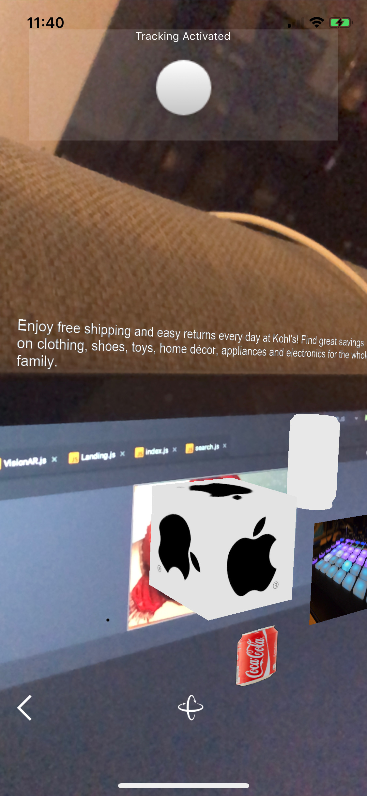
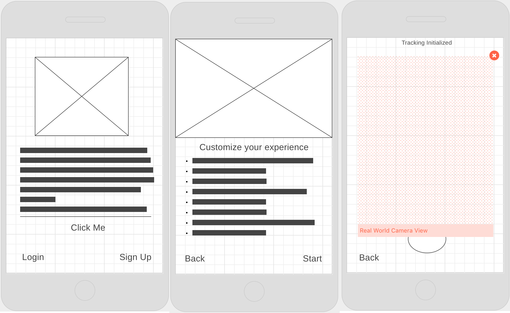

# Ad-Vision

This is an Augmented Reality application that renders ads on the screen. Using real-world objects/images a device recognizes, the application will be able to render different forms of media and objects on the screen providing useful information to the user. 

# Continuous Integration
Travis CI Status\

## Tools:

* ViroReact
* React Native
* Express
* Node.js
* Cloud Vision API
* Bing Custom Search

## Team Members & Roles

* Kelvin Jones || [Wizkym](https://github.com/Wizkym) || Viro-React implementation + Cloud Vision API 
* George Rincon || [grincon0](https://github.com/grincon0) || ParticleSFX & 3D Component Development
* David Baker || [DavidDBaker](https://github.com/DavidDBaker) || 3D component testing + Bing Web Search API

## Demo

## Trello

## Wireframe

